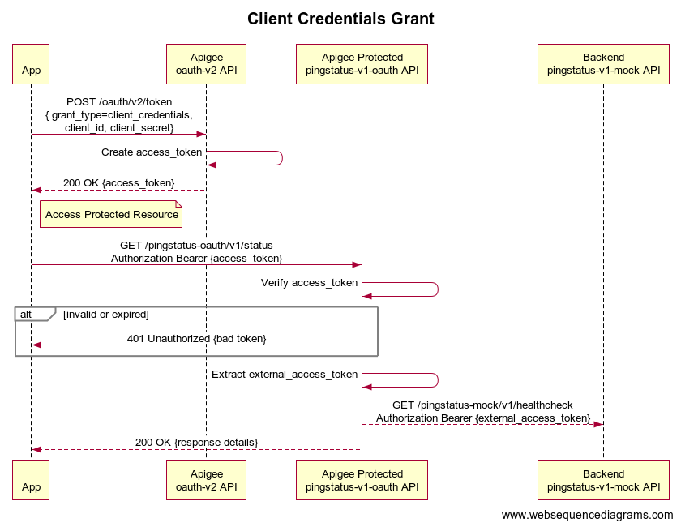
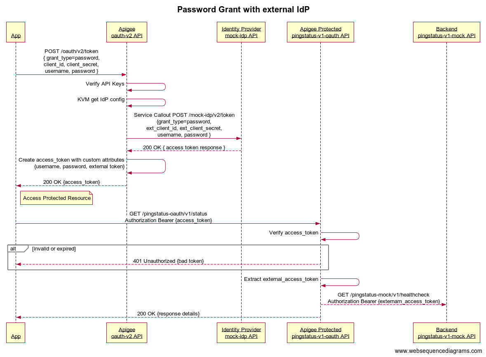

# OAuth V2 Proxy for Client Credentials and Password Grant Types

## Overview
This group of example proxies supports Client Credentials and Password grant types.

- Client Credentials is supported directly with Apigee as the Application credential owner using the [oauth-v1](oauth-v1/README.md) proxy.
- Password grant type is supported using the same [oauth-v1](oauth-v1/README.md) proxy and a mock IdP implemented in the [idp-v1-mock](idp-v1-mock/README.md) proxy.
- The [pingstatus-oauth-v1](pingstatus-oauth-v1/README.md) proxy is the protected resource.
- The [pingstatus-v1-mock](pingstatus-v1-mock/README.md) proxy is the mock backend for the [pingstatus-oauth-v1](pingstatus-oauth-v1/README.md) proxy.

## Sequence Diagrams




## Deploy and Test
Install all proxies and related test artifacts such as API Product, Developer and Applications. 

This command iterates through each of the proxies subdirectories and runs `mvn -P test install` there.

```
export PROFILE=dev
mvn -P $PROFILE install
```

## Disclaimer
This example is not an official Google product, nor is it part of an official Google product.

## License
This material is copyright 2019, Google LLC. and is licensed under the Apache 2.0 license. See the LICENSE file included.

This code is open source.

## TODO
* Document use of request header x-jwt and JWT flows.
* OAS for oauth-v1
* Cloud Build